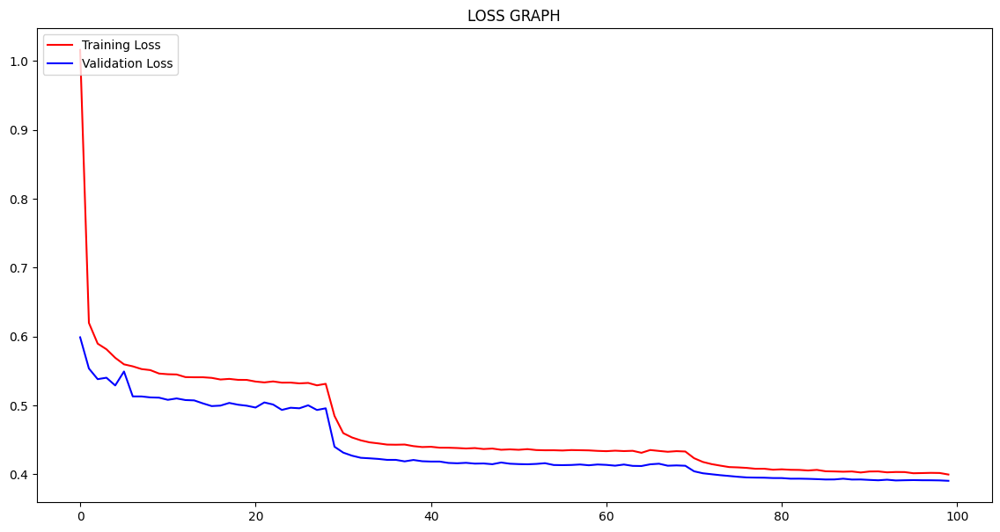
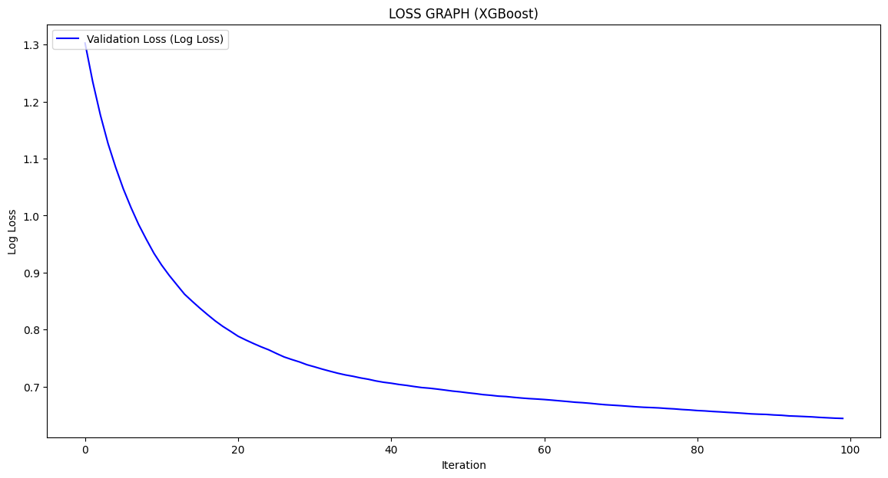

# Multi-Labels-URLs-ML-DL-Detection-Models

# Phishing Website Detection Models

#Dataset Features

### Dataset Features Overview (from `scripts/url_features_extractor.py` → `extract_to_dataset()`)
- Total: 91 features (59 URL/lexical, 27 content-based, 6 external) + 1 label.

- URL/Lexical features (examples):
  - Length and entropy: `url_len`, `hostname_len`, `entropy`
  - Character/count metrics: `nb_dots`, `nb_hyphens`, `nb_at`, `nb_slash`, `nb_dslash`, `nb_exclamation`, `nb_and`, `nb_or`, `nb_equal`, `nb_underscore`, `nb_tilde`, `nb_percentage`, `nb_colon`, `nb_comma`, `nb_semicolumn`, `nb_dollar`, `nb_space`, `nb_star`, `nb_fragments`, `nb_http_token`, `nb_subdomain`, `nb_www`, `nb_com`, `nb_redirection`, `nb_e_redirection`, `nb_phish_hints`
  - Boolean anomaly flags: `has_ip`, `has_https`, `has_punnycode`, `has_port`, `has_tld_in_path`, `has_tld_in_subdomain`, `has_abnormal_subdomain`, `has_prefix_suffix`, `has_short_svc`, `has_path_txt_extension`, `has_path_exe_extension`, `has_domain_in_brand`, `has_brand_in_path`, `has_sus_tld`, `has_statistical_report`
  - Token statistics: `word_raw_len`, `char_repeat`, shortest/longest/average lengths by URL/host/path: `shortest_*`, `longest_*`, `avg_*`
  - Digit ratios: `ratio_digits_url`, `ratio_digits_host`

- Content-based features (examples):
  - Page state & size: `is_alive`, `body_len`, `script_len`, `empty_title`
  - Element counts: `nb_hyperlinks`, `nb_ex_css`, `nb_titles`, `nb_imgs`, `nb_special_char`
  - UI risk flags: `has_login_form`, `has_ex_favicon`, `has_submit_email`, `has_iframe`, `has_onmouse`, `has_popup`, `has_right_click`, `has_copyright_domain`
  - Ratios & percents: `ratio_in_hyperlinks`, `ratio_ex_hyperlinks`, `ratio_script_special_chars`, `ratio_script_body`, `ratio_body_special_chars`, `percent_in_media`, `percent_ex_media`, `percent_safe_anchor`, `percent_in_links`

- External/WHOIS & search (examples):
  - `whois_reg_domain`, `domain_reg_len`, `domain_age`, `dns_record`, `google_index`, `page_rank`

- Label: `label` (benign/defacement/malware/phishing)


## Introduction
This project implements a fast, scalable malicious URL detection system capable of classifying URLs into four categories: benign, defacement, malware, and phishing. It features an optimized Python-based URL feature extraction pipeline used for large-scale dataset generation (~600k URLs) and real-time prediction. The dataset imbalance was addressed by augmenting the “malware” class with additional samples from the URLHaus database, producing balanced subsets for model training. Four models—CNN, XGBoost, Random Forest, and Transformer-BERT—were trained and evaluated in Google Colab using metrics such as Confusion Matrix, Macro-F1 score, PR-AUC, and Macro-PR-AUC.

## Summary Results of Each Model

### 1. CNN with Numerical Features
- **Model Architecture**  
  
- **Accuracy Graph**  
  
- **Loss Graph**  
  
- **Confusion Matrix**  
  
- **PR-AUC Graph**
  

### 2. CNN with Non-Numerical Features
- **Model Architecture**  
  
- **Accuracy-Loss Graph**  
  
- **Loss Graph**  
  
- **Confusion Matrix**  
  
- **PR-AUC Graph**
  

### 3. XGBoost with Numerical Features
- **Accuracy Graph**  
  
- **Loss Graph**  
  
- **Confusion Matrix**  
  

### 4. XGBoost with Non-Numerical Features
- **Accuracy Graph**  
  
- **Loss Graph**  
  
- **Confusion Matrix**  
  

### 5. Random Forest with Numerical Features
- **Confusion Matrix**  
  
- **PR-AUC Graph**
  

### 6. Random Forest with Non-Numerical Features
- **Confusion Matrix**  
  
- **PR-AUC Graph**
  

### 7. Transformer’s BERT with Non-Numerical Features
- **Model Architecture**  
    ```
        ==============================================================================================================
        Layer (type:depth-idx)                                       Output Shape              Param #
        ==============================================================================================================
        Transformer                                                  [1, 4]                    --
        ├─BertModel: 1-1                                             [1, 768]                  --
        │    └─BertEmbeddings: 2-1                                   [1, 64, 768]              --
        │    │    └─Embedding: 3-1                                   [1, 64, 768]              23,440,896
        │    │    └─Embedding: 3-2                                   [1, 64, 768]              1,536
        │    │    └─Embedding: 3-3                                   [1, 64, 768]              393,216
        │    │    └─LayerNorm: 3-4                                   [1, 64, 768]              1,536
        │    │    └─Dropout: 3-5                                     [1, 64, 768]              --
        │    └─BertEncoder: 2-2                                      [1, 64, 768]              --
        │    │    └─ModuleList: 3-6                                  --                        85,054,464
        │    └─BertPooler: 2-3                                       [1, 768]                  --
        │    │    └─Linear: 3-7                                      [1, 768]                  590,592
        │    │    └─Tanh: 3-8                                        [1, 768]                  --
        ├─Sequential: 1-2                                            [1, 4]                    --
        │    └─Linear: 2-4                                           [1, 512]                  393,728
        │    └─ReLU: 2-5                                             [1, 512]                  --
        │    └─Dropout: 2-6                                          [1, 512]                  --
        │    └─Linear: 2-7                                           [1, 4]                    2,052
        ==============================================================================================================
        Total params: 109,878,020
        Trainable params: 109,878,020
        Non-trainable params: 0
        Total mult-adds (Units.MEGABYTES): 109.88
        ==============================================================================================================
        Input size (MB): 0.00
        Forward/backward pass size (MB): 53.49
        Params size (MB): 439.51
        Estimated Total Size (MB): 493.00
        ==============================================================================================================
    ```
- **Accuracy Graph**  
  
- **Loss Graph**  
  
- **Confusion Matrix**  
  
- **PR-AUC Graph**
  

## Set up and Deploy

### Dependencies & Libraries
- **Python Version**: 3.12.1
- **Installation**:
  ```bash
  pip install -r requirements.txt
  ```

### Web Application
- **Run the Flask App**:
  ```bash
  python ./run.py
  ```
- **Testing with Postman**:
  - **URL**: `http://localhost:5000/api/predict-url`
  - **Body (JSON)**:
    ```json
    {
        "url": "https://example.com",
        "model": "cnn",
        "threshold": 0.5,
        "numerical": 1
    }
    ```
  - **URL**: `http://localhost:5000/api/predict-multi-model`
  - **Body (JSON)**:
    ```json
    {
        "url": "https://example.com",
        "threshold": 0.5,
    }
    ```

- **DOWNLOAD TRANSFORMERS's BERT MODEL**
  - Important: Because the TRANSFORMERS's BERT model cant be push via git you must download it seperately here: [transformers-bert-download](https://drive.google.com/file/d/135r1afyC3LyVncyvrpK050TuUh5_9sdf/view?usp=drive_link)

### Extension
- **Installation**:
  - Open your browser.
  - Import the `brower-extension` folder to load the extension.
## Resources
- **Dataset**: [Web Page Phishing Detection Dataset](https://www.kaggle.com/datasets/shashwatwork/web-page-phishing-detection-dataset/)  
- **Python Script References**: [Mendeley Data](https://data.mendeley.com/datasets/c2gw7fy2j4/3)  
- **Jupyter Notebook**: [View on nbviewer](https://nbviewer.org/github/DinhQuocToan-N21DCAT057/Phishing-Website-Detection-Models/blob/main/LSTM-CNN-Transformer-Phising-Website-Detection.ipynb)
